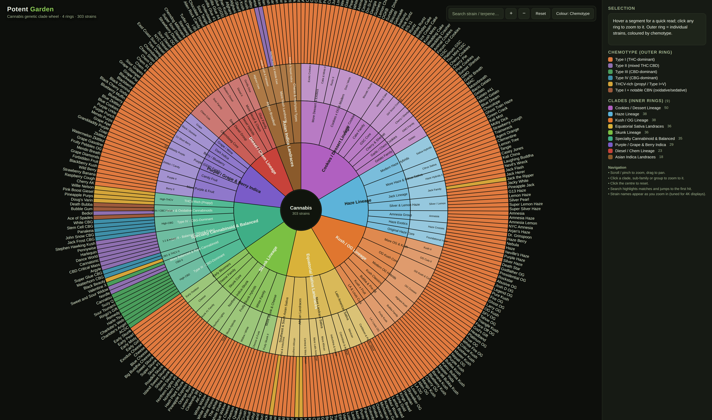

# 🌿 Potent Garden — Cannabis Genetic Clade Wheel

An interactive **4-ring genetic clade wheel** (sunburst) of **303 representative
cannabis cultivars**, curated to span the plant's genetic lineages and its full
chemotype spectrum — THC, mixed/balanced, CBD, CBG, THCV, and CBN.



## The four rings

| Ring | Level | Example |
|---|---|---|
| 1 | **Clade** — major genetic lineage (9) | *Haze Lineage* |
| 2 | **Sub-family** — branch within a clade | *Jack Lineage* |
| 3 | **Group** — tight cut / cluster | *Jack Family* |
| 4 | **Strain** — the leaf (303 total) | *Jack Herer* |

Each strain leaf carries its **parents**, a one-line **description**, the
**top 3–8 terpenes in dominance order**, its **chemotype**, and approximate
**cannabinoid ranges** (THC / CBD / CBG / THCV, or a mixed ratio).

## The nine clades

Equatorial Sativa Landraces · Asian Indica Landraces · Haze Lineage ·
Skunk Lineage · Kush / OG Lineage · Diesel / Chem Lineage ·
Cookies / Dessert Lineage · Purple / Grape & Berry Indica ·
Specialty Cannabinoid & Balanced (CBD / CBG / THCV / CBN / mixed).

## Chemotype coverage (de Meijer / Hillig framework)

| Chemotype | Strains | Examples |
|---|---|---|
| **Type I** — THC-dominant | 262 | Haze, GG#4, GSC, Sour Diesel |
| **Type II** — mixed THC:CBD | 12 | Cannatonic, Harlequin, Pennywise |
| **Type III** — CBD-dominant | 10 | ACDC, Charlotte's Web, Harle-Tsu |
| **Type IV** — CBG-dominant | 7 | White CBG, Panakeia, Matterhorn CBG |
| **THCV-rich** (propyl) | 9 | Doug's Varin, Durban Poison, Black Beauty |
| **CBN-forward** (oxidative) | 3 | Death Bubba, Bubble Gum, Ace of Spades |

## Files

| File | What it is |
|---|---|
| `potent_garden_clade_wheel.html` | The interactive wheel — **open this in a browser** |
| `build_data.py` | Source-of-truth generator (all strain data lives here) |
| `potent_garden_clade_wheel.json` | The generated 4-ring hierarchy + flat strain list |
| `clade_wheel_data.js` | Same payload as a JS global, so the HTML opens by double-click |
| `strains_table.md` | Flat reference table of every strain + **References** |
| `d3.v7.min.js` | Vendored D3 v7 (no CDN needed — works offline) |

## Viewing the wheel

Just **double-click `potent_garden_clade_wheel.html`** — it loads its data from
`clade_wheel_data.js`, so no local server is required.

The visualization is tuned for **high-density / 4K displays** with small text:

- **Scroll / pinch** to zoom, **drag** to pan.
- **Click** any clade, sub-family, or group to smooth-zoom to it; **click the
  centre** (or *Reset*) to zoom back out.
- **Hover** any segment for a tooltip; the side panel shows full detail.
- **Search** by strain, terpene, or parent — matches highlight and the view
  jumps to the first hit.
- **Colour** toggle: outer ring by **chemotype** (default) or by **clade**.
- Inner rings are always coloured by **clade**; strain labels fade in as you
  zoom, so a 4K screen can show hundreds of names legibly.

## Regenerating the data

```bash
python3 build_data.py
```

This rebuilds the JSON, the JS payload, and `strains_table.md`, and asserts
that there are 250+ leaf strains, no duplicate names, and that every anchor
strain from the brief is present (Haze, White Widow, Early Pearl, Skunk #1,
Amnesia Haze, Jack Herer, Cinderella 99, Black Domina, Thai, Afghani, GG#4,
Sour Diesel, Cherry Pie, Granddaddy Purple, GSC, Biscotti, RS-11, GMO, SFV OG,
Tahoe OG, Louis XIII, Oaxacan). It prints a progress report every 12 strains.

## Methodology & sources

Lineages, terpene orders, and chemotypes are grounded in established
cannabis-genetics knowledge and public aggregate lab data (Leafly, SeedFinder,
Strainpedia, Sensi/Green House/DNA breeder records) and peer-reviewed chemotype
literature (de Meijer 2003/2005/2016; Hillig & Mahlberg 2004; Lewis et al.
2018). Clone-only cuts have disputed pedigrees; parentage is best-consensus and
terpene/cannabinoid figures are indicative ranges, not single assays. See the
**References** section of [`strains_table.md`](strains_table.md) for full
citations and caveats.
